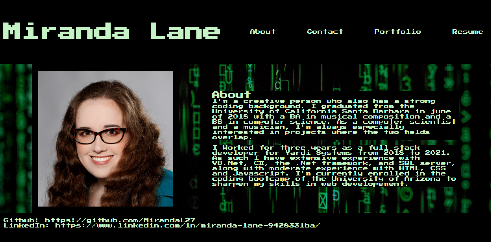

# Portfolio

# Description

This project is a single-page-application consisting of:
* A header- featuring a nav bar for navigating to the various pages.
* An about page - featuring a picture and some information about the developer.
* A portfolio page - featuring 6 projects that the developer has completed.
* A Contact page - featuring a contact form with form validation and a submit button.
* A resume page - featuring resume contents and a downloadable resume copy.
* A footer - featuring github and linkedIn links.
The purpose of this project was to practice creating react applications. 

# Technologies used

* React
* JSX
* CSS
* JavaScript

# Screenshots

Deployed Page: 

# Credits
Miranda Lane
Photo Attribution: Photo by Markus Spiske from Pexels
